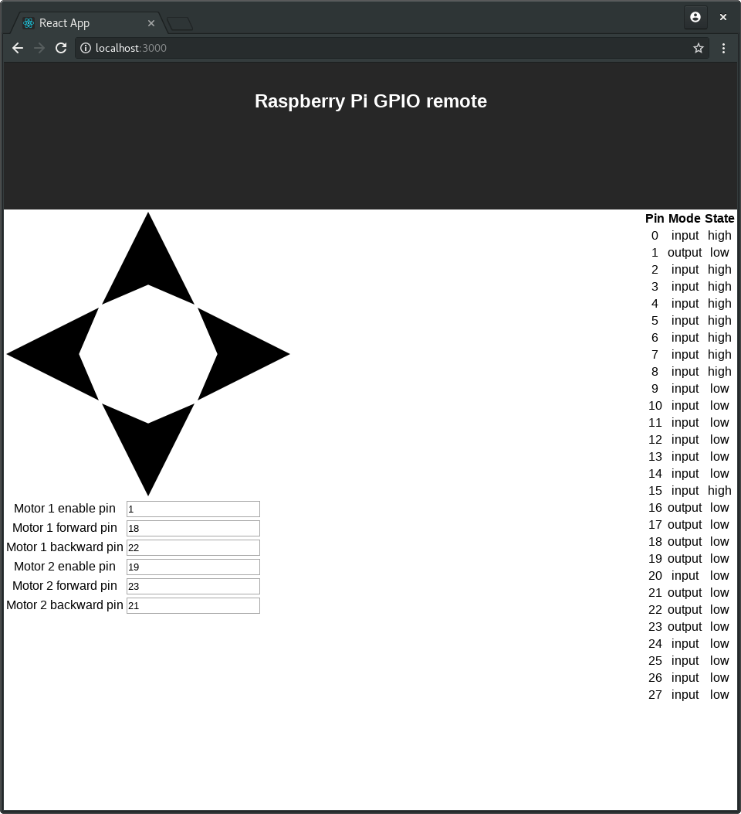

# GPIO remote

A remote control application for Raspberry Pi powered robots. 

To use:
1. Download the zip from 
[https://raw.githubusercontent.com/MFAshby/gpio-remote/master/gpio-remote.zip]
2. Extract it to your preferred location and run 'gpio-remote' executable
3. Open a web browser to your Pi's IP address at port 8080 (e.g. 192.168.1.200:8080)
4. Set the correct pins for controlling the motors.
5. Drive around & scare your dog.

To build: 
1. Install go [https://golang.org/] & node [https://nodejs.org/]
2. Clone the source code
`git clone https://github.com/MFAshby/gpio-remote.git`
3. Run the build script
`cd gpio-remote && ./build.sh`
4. Run the server & connect via your web browser as above
`./gpio-remote`

  
